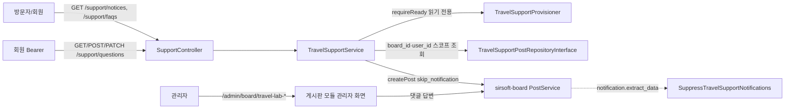

# 고객지원 (공지 · FAQ · 1:1 문의)

> 소유: module `raonslab-travel_lab` · 범위: 고객지원 채널, 관리자 레이아웃(`/admin/travel-lab/**`)
> API 레퍼런스: [support-api.md](support-api.md)

## 1. 설계 의도

여행 연구소는 고객지원을 위한 **별도 게시판 도메인을 만들지 않는다.** 공지사항·FAQ·1:1 문의는 그누보드7 게시판 모듈(`sirsoft-board`)의 게시판 3개를 그대로 재사용하고, 이 모듈은 다음 두 가지만 책임진다.

1. **채널 스코프** — 어떤 게시판의 어떤 글을 누구에게 보여 줄지 (`TravelSupportService`)
2. **LAB 안전 기준** — 게시판 설정·알림·첨부가 합성 데이터에 안전한 상태인지 (`TravelSupportProvisioner`)

| 채널 | 게시판 슬러그 | 공개 범위 | 비밀글 | 댓글(답변) | 첨부 |
| --- | --- | --- | --- | --- | --- |
| 공지사항 | `travel-lab-notices` | 누구나 읽기 | 사용 안 함 | 끔 | 끔 |
| FAQ | `travel-lab-faqs` | 누구나 읽기 | 사용 안 함 | 끔 | 끔 |
| 1:1 문의 | `travel-lab-questions` | 작성자 본인 + `support.read` 관리자 | **항상** | 켬 (관리자 답변) | 끔 |

세 게시판은 모두 `is_active=false` 로 만든다. 그래서 게시판 모듈의 공개 라우트(`/api/modules/sirsoft-board/boards/{slug}/**`), 사용자 메뉴, 게시판 목록, 검색에 노출되지 않는다. 방문자 경로는 이 모듈의 고객지원 API 뿐이고, 관리자는 게시판 모듈의 기존 관리자 화면(`/admin/board/{slug}`)에서 그대로 관리한다. 기존 `raonslab-product` 게시판·페이지는 읽지도 고치지도 않는다.

## 2. 데이터 흐름



## 3. 격리 규칙 (fail-closed)

- **문의 목록**: `raonslab-travel_lab.support.read`(admin 타입) 권한이 없으면 항상 `user_id = 본인` 조건이 걸린다. 게시판 모듈의 `paginate` 는 1페이지에 공지를 필터 무시로 섞으므로 쓰지 않고, `TravelSupportPostRepository` 가 `board_id`·`status=published`·`parent_id IS NULL`·`user_id` 를 where 절로 고정한다.
- **문의 상세/수정**: 작성자도 아니고 관리자 권한도 없으면 **404** (403 이 아니다 — 존재 여부를 숨긴다). 수정은 작성자 또는 `support.update` 관리자만 가능하다.
- **문의 저장**: 입력에서는 `title`·`content` 만 받는다. `is_secret=true`·`user_id=인증 사용자`·첨부 없음은 서비스가 강제하며, 요청 본문의 `is_secret`·`user_id`·`attachment_ids` 는 무시된다.
- **응답 직렬화**: `user_id`·`ip_address`·`password`·`action_logs` 는 내보내지 않는다. 답변(댓글)은 답변자 계정 정보 없이 `is_author` 만 싣는다.
- **채널 스코프**: 공지 ID 로 FAQ 상세를, 공지 ID 로 문의 상세를 조회하면 404 다.
- **미준비 상태**: 게시판이 없거나 안전 기준과 다르면 모든 고객지원 엔드포인트가 **503** 으로 닫힌다. 요청 경로는 게시판을 만들거나 고치지 않는다.

## 4. 알림 억제

합성 LAB 문의에는 메일·문자·알림이 나가면 안 된다. 방어는 세 겹이다.

1. 게시판 정의: `notify_author=false`, `notify_admin_on_post=false` (게시판 모듈의 추출 단계가 skip)
2. 이 모듈의 쓰기: `PostService::createPost(..., options: ['skip_notification' => true])`
3. `SuppressTravelSupportNotifications` 필터(`sirsoft-board.notification.extract_data`, priority 95): 관리자가 게시판 관리자 화면에서 답변·블라인드·삭제를 해도 **travel-lab-\* 게시판에서 나온 알림만** `context.skip=true` 로 바꾼다. 다른 게시판(`raonslab-product` 상담 게시판 포함)은 그대로 통과시킨다.

`ExcludeTravelSupportQuestionsFromSearch` 는 문의 게시판 글을 검색 색인에서 뺀다.

## 5. LAB 프로비저닝

```bash
# .env 또는 config 로 명시 허용한 LAB 환경에서만
php artisan raonslab-travel_lab:support-provision --lab-confirm
```

- `config('raonslab-travel_lab.support.lab_provisioning') === true` **이고** `--lab-confirm` 일 때만 쓴다. 문자열 `"1"` 같은 느슨한 값은 거부한다. 기본값은 꺼짐이다.
- 설치·업데이트·스케줄러·요청 경로 어디에도 연결하지 않는다.
- 쓰기 전에 세 슬러그의 기존 게시판을 전부 검증한다. 같은 슬러그의 게시판이 안전 기준(비활성·알림 끔·첨부 끔·신고 끔·문의 비밀글 강제·공지/FAQ 비밀글 끔)과 다르면 **아무것도 만들거나 고치지 않고** 실패한다.
- 합성 공지 3건·FAQ 4건은 `action_logs[].provenance_key = raonslab.travel_lab.support.v1:{channel}:{key}` 로 식별한다. 재실행해도 중복되지 않고, 관리자가 제목·본문을 고쳐도 덮어쓰지 않는다.
- 합성 콘텐츠 원문: `src/Services/TravelSupportSeedContent.php` (이 모듈을 위해 새로 쓴 문구, 실제 가격·예약을 약속하지 않음)

## 6. 관리자 화면

| 경로 | 레이아웃 | 권한 | 데이터 |
| --- | --- | --- | --- |
| `/admin/travel-lab`, `/admin/travel-lab/catalog` | `admin_travel_lab_catalog` | `raonslab-travel_lab.catalog.read` | `GET /admin/catalog`, `PUT /admin/catalog/{product}/departures/{departure}` |
| `/admin/travel-lab/inquiries` | `admin_travel_lab_inquiry_list` | `raonslab-travel_lab.inquiries.read` | `GET /admin/inquiries?status=&page=` |
| `/admin/travel-lab/inquiries/:id` | `admin_travel_lab_inquiry_detail` | `raonslab-travel_lab.inquiries.read` | `GET/PATCH /admin/inquiries/{id}` |
| `/admin/travel-lab/support` | `admin_travel_lab_support` | `raonslab-travel_lab.support.read` | 게시판 관리자 화면 링크만 |

- 가격·옵션은 이커머스가 소유한다. 카탈로그 화면은 가격을 표시·수정하지 않고 「이커머스 상품 관리 열기」(`/admin/ecommerce/products/{product_code}/edit`)로 연결한다. 출발일 PUT 본문은 `{product_option_id, departure_date, return_date, capacity, is_active}`이다. departure는 여행 출발 ID이며 옵션 ID와 다르다.
- 문의 상태 전환 버튼은 서버가 상세 응답에 주는 `allowed_transitions` 만 반복한다. 화면에는 전이표가 없다 (서버가 SSoT).
- 저장 성공/실패는 공통 `toast`, 목록↔상세 이동은 `mergeQuery: true` 로 목록 상태를 보존한다. 섹션 이동·외부 화면 이동만 `audit:allow` 사유와 함께 비병합이다.
- 번역: `resources/lang/partial/{ko,en}/admin.json` (`$t:raonslab-travel_lab.admin.*`).

### 6.1 통합 후 실제 관리자 계약

도메인/워크플로 Resources와 동일 버전의 바인딩을 사용한다. 카탈로그는 `data.data`와 `data.pagination`, `data.abilities.can_update`를 반환하며 각 상품 `id`는 커머스 상품 ID이고 `product_code`는 커머스 편집 링크에 사용한다. 출발에는 `id`, `product_option_id`, `departure_date`, `return_date`, `capacity`, `reserved`, `is_active`, `available`이 있다. 상품 메타는 `PATCH /admin/catalog/{product}`, 출발은 `PUT /admin/catalog/{product}/departures/{departure}`에 저장한다.

시험 문의 목록·상세는 대문자 enum 상태와 서버 `allowed_transitions`, 권한 `abilities`, `data.pagination`을 사용한다. 상태 PATCH는 `status,admin_note`를 보낸다. 같은 상태에서 메모만 변경하면 저장과 처리자 이력이 남고 완전히 동일한 재요청만 no-op다. 기존 child 가정 필드나 옵션 ID를 출발 ID로 사용하는 계약은 폐기되었다. 자세한 전체 필드는 `docs/api/workflow.md`, `docs/domain-api.md`를 따른다.

## 7. 등록 통합 (리드 소유 파일에 반영할 것)

| 위치 | 반영 내용 |
| --- | --- |
| `src/routes/api.php` | `require __DIR__.'/support.php';` (prefix·name·`api` 미들웨어는 ModuleRouteServiceProvider 가 부여) |
| Provider `register()` | `$this->app->bind(TravelSupportPostRepositoryInterface::class, TravelSupportPostRepository::class);` |
| Provider `boot()` 또는 `module.php` | 콘솔 커맨드 `ProvisionTravelSupportCommand` 등록 |
| `module.php::getHookListeners()` | `SuppressTravelSupportNotifications::class`, `ExcludeTravelSupportQuestionsFromSearch::class` |
| `module.php::getPermissions()` | 카테고리 `support` — `read`, `update` (type `admin`, roles `admin`). `catalog`·`inquiries` 의 `read`·`update` 는 도메인 정의에 포함 |
| `module.php::getAdminMenus()` | `/admin/travel-lab` (permission `raonslab-travel_lab.catalog.read`) — 하위 메뉴 문의·고객지원 |
| `config/*.php` | `'support' => ['lab_provisioning' => env('RAONSLAB_TRAVEL_LAB_SUPPORT_LAB_PROVISIONING', false) === true]` 형태로 **기본 false** 를 명시 (`env()` 문자열을 boolean 으로 엄격 변환) |
| `resources/lang/{ko,en}.json` | `"admin": {"$partial": "partial/{ko,en}/admin.json"}` |
| `resources/routes.json` | 이 작업의 관리자 경로 5건 (방문자 경로는 템플릿 소유) |
| `module.json` dependencies | `sirsoft-board >= 1.1.2` (게시판 재사용), `sirsoft-ecommerce >= 1.2.1` |
| `composer.json` autoload | `Modules\\Raonslab\\TravelLab\\` → `src/` (테스트 베이스의 보강 오토로더는 통합 전 실행용) |

## 8. 테스트 — 자가 검증과 독립 검증의 구분

**자가 검증(이 작업자가 실행, 독립 검증이 아님)**

```bash
php vendor/bin/phpunit modules/_bundled/raonslab-travel_lab/tests          # 18 tests
cd modules/_bundled/raonslab-travel_lab && ../../../node_modules/.bin/vitest run  # 13 tests
```

시나리오 매니페스트: `tests/scenarios/travel-support.yaml`

**독립 검증 레시피(통합 후 다른 검증자가 실행)**

1. 등록 통합 후 위 두 명령을 재실행 (테스트 베이스의 수동 라우트·바인딩 대신 실제 provider 경로로도 통과해야 한다).
2. LAB 인스턴스에서 `support-provision --lab-confirm` 을 두 번 실행 → 두 번째 출력이 `created=no seeded=0` 인지 확인.
3. 서로 다른 두 회원 토큰으로 문의를 등록하고 교차 `GET/PATCH /support/questions/{id}` 가 404 인지 확인.
4. 메일 드라이버 로그·`notifications` 테이블에 travel-lab 게시판 발생 행이 없는지 확인.
5. `/api/modules/sirsoft-board/boards/travel-lab-questions` 가 404 인지 확인.
