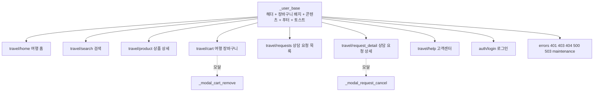
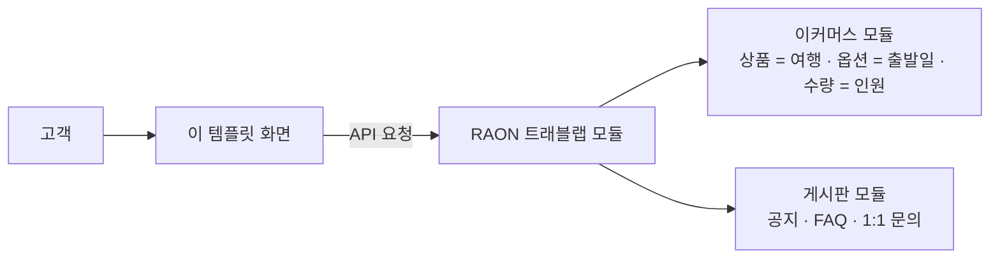

# 그누보드7 RAON 트래블랩 템플릿

**그누보드7 템플릿 · raonslab-travel_lab**
여행 상품 탐색 · 출발일/인원 선택 · 여행 장바구니 · 상담 요청(테스트) 고객 화면 템플릿

<!-- @generated:badges START — ext:docgen 이 갱신. 이 블록 안은 직접 수정하지 않는다 -->
<p align="center">
  
  
  
  
  
  
  
  
</p>
<!-- @generated:badges END -->

---

[소개](#소개) · [주요 기능](#주요-기능) · [동작 방식](#동작-방식) · [요구 사항](#요구-사항) · [설치](#설치) · [제공 컴포넌트](#제공-컴포넌트) · [사용 방법](#사용-방법) · [다른 확장과의 연동](#다른-확장과의-연동) · [문서](#문서) · [트러블슈팅](#트러블슈팅) · [변경 이력](#변경-이력) · [라이선스](#라이선스)

---

## 소개

<!-- @intent START -->
여행 상품을 고객에게 보여주는 **사용자 화면 템플릿**입니다. 여행지를 둘러보고, 출발일과 인원을
골라 여행 장바구니에 담고, 상담 요청을 남기고, 고객센터에서 공지·FAQ·1:1 문의를 이용하는 흐름을
한 디자인으로 제공합니다. 화면 폭 390px(모바일)부터 1440px(데스크톱)까지 맞춰지며, 밝은 단일
테마입니다.

데이터는 별도 모듈 **RAON 트래블랩 모듈(`raonslab-travel_lab`)** 이 제공합니다. 이 템플릿은
화면만 담당하므로, 여행 모듈과 이커머스·게시판·페이지 모듈이 함께 설치되어 있어야 합니다.
여행 상품은 이커머스 상품, 출발일은 별도 여행 Departure가 해당 상품 옵션을 참조하며, 인원은 여행 장바구니 수량으로 관리됩니다.

**상담 요청은 테스트 기능입니다.** 요청 상태(테스트 접수 · 검토 중 · 테스트 수락 · 거절 · 취소)는
모두 시뮬레이션이며 실제 예약·결제·환불은 일어나지 않습니다. 고객은 요청 전에 이 사실을 확인하는
체크박스를 반드시 켜야 합니다.

**의도적으로 하지 않는 것**: 실제 예약·결제·환불 처리 · 다크 모드 · 외부 사진·CDN 사용. 상품
이미지가 없을 때는 이 템플릿이 직접 그린 풍경 일러스트가 대신 표시됩니다.
<!-- @intent END -->

## 주요 기능

<!-- @intent START -->
| 영역 | 설명 |
|---|---|
| 여행 홈 (`/`, `/travel`) | 추천 여행 · 곧 출발하는 여행 · 지역/테마 바로가기 |
| 검색 (`/travel/search`) | 키워드 · 지역 · 테마 · 출발일 범위 · 가격 범위 필터, 추천순/가격순/출발일순 정렬, 페이지 이동. 필터 상태가 주소에 남아 상세를 보고 돌아와도 유지 |
| 상품 상세 (`/travel/products/:id`) | 상품 정보, 출발일 선택, 인원 선택, 여행 장바구니 담기 (로그인 필요) |
| 여행 장바구니 (`/travel/cart`) | 담은 출발편의 인원 변경·삭제, 합계, 연락처 입력 후 상담 요청(테스트) — 로그인 필요 |
| 상담 요청 (`/travel/requests`, `/travel/requests/:id`) | 내 요청 목록·상세·상태 확인, 요청 취소 — 로그인 필요 |
| 고객센터 (`/travel/help`) | 공지 · FAQ(검색) 공개, 1:1 문의 작성·답변 확인은 로그인 후 |
| 로그인 (`/login`) | 이메일/비밀번호 로그인, 2단계 인증이 켜진 사이트에서는 인증 코드 입력 단계 |
| 오류 화면 | 401 · 403 · 404 · 500 · 503 · 점검 중 |
| 금액 표기 | 상점에 설정된 통화 그대로 표시 (특정 통화 고정 없음) |
| 중복 요청 방지 | 요청 버튼을 여러 번 누르거나 네트워크 오류 후 다시 보내도 요청이 한 번만 접수 |
<!-- @intent END -->

## 동작 방식

<!-- @intent START -->


모든 화면이 하나의 공통 뼈대를 물려받습니다. 뼈대가 헤더의 장바구니 개수 배지와 알림(토스트)을
담당하므로 어느 화면에서든 같은 모습으로 나타납니다.



화면은 자기 데이터를 갖지 않고 여행 모듈에 요청해 받아옵니다. 금액도 서버가 계산한 값만
표시하며, 화면에서 금액을 서버로 보내지 않습니다.
<!-- @intent END -->

## 요구 사항

<!-- @generated:requirements START — ext:docgen 이 갱신. 이 블록 안은 직접 수정하지 않는다 -->
| 항목 | 값 |
|---|---|
| 그누보드7 코어 | `>=7.0.12` |
| PHP | `^8.2` |
| 의존 모듈 | `raonslab-travel_lab` `>=0.1.3` |
| 의존 모듈 | `sirsoft-board` `>=1.1.2` |
| 의존 모듈 | `sirsoft-ecommerce` `>=1.2.1` |
| 의존 모듈 | `sirsoft-page` `>=1.1.2` |
<!-- @generated:requirements END -->

## 설치

<!-- @generated:install START — ext:docgen 이 갱신. 이 블록 안은 직접 수정하지 않는다 -->
```bash
# 번들 설치 (코어에 동봉된 소스에서 설치)
php artisan template:install raonslab-travel_lab

# 활성화
php artisan template:activate raonslab-travel_lab

# 업데이트 (번들 소스 기준 강제 반영)
php artisan template:update raonslab-travel_lab --force
```
<!-- @generated:install END -->

## 제공 컴포넌트

<!-- @generated:settings-summary START — ext:docgen 이 갱신. 이 블록 안은 직접 수정하지 않는다 -->
컴포넌트 30개 (루트: `src/components`).

| 분류 | 개수 |
|---|---|
| `basic` | 23개 |
| `composite` | 7개 |
<!-- @generated:settings-summary END -->

<!-- @intent START -->
기본 부품 23개와 조합 부품 6개입니다. 조합 부품 중 알림(Toast) · 모달(Modal) · 페이지 이동
(Pagination)은 `sirsoft-basic` 템플릿(MIT)에서 가져온 것이고, 나머지 셋이 이 템플릿 고유
부품입니다.

| 부품 | 하는 일 |
|---|---|
| 풍경 일러스트 (ScenicArt) | 해안 · 산 · 도시 · 섬 · 숲 · 사막 · 설경 · 호수 8가지 장면을 직접 그린 그림. 상품 이미지가 없을 때 대신 표시되고, 같은 상품은 항상 같은 장면을 받는다 |
| 금액 표기 (PriceTag) | 서버가 알려준 통화로 기호·소수 자릿수를 정해 표시 |
| 상태 배지 (StatusBadge) | 상담 요청 상태를 색과 문구로 표시 |

부품 목록은 **다른 확장과의 계약**이기도 합니다. 다른 확장이 이 템플릿 화면에 조각을 끼워 넣을
때 여기 없는 부품을 쓰면 그 조각은 그려지지 않습니다. 전체 목록은
[docs/components.md](docs/components.md) 에 있습니다.
<!-- @intent END -->

## 사용 방법

<!-- @intent START -->
**설치하기**: 의존 모듈을 먼저 설치·활성화한 뒤 이 템플릿을 설치합니다. 여행 모듈
`raonslab-travel_lab` 은 별도로 빌드·배포되므로 코어에 동봉되어 있지 않을 수 있습니다.

```bash
php artisan module:install raonslab-travel_lab
php artisan module:activate raonslab-travel_lab
php artisan template:install raonslab-travel_lab
php artisan template:activate raonslab-travel_lab
```

활성화하면 사이트 첫 화면(`/`)이 여행 홈으로 바뀝니다. 원래 템플릿으로 되돌리려면 그 템플릿을
다시 활성화합니다.

**여행 상품 올리기**: 관리자에서 이커머스 상품을 여행 상품으로 등록하고, 출발일마다 상품 옵션을
만듭니다. 지역·테마 분류는 여행 모듈이 알려주는 목록이 검색 화면에 그대로 나옵니다. 상품
이미지를 등록하지 않아도 풍경 일러스트가 대신 표시됩니다.

**상담 요청 처리 흐름 확인하기**: 고객 계정으로 상품을 장바구니에 담고, 테스트 고지를 확인한 뒤
상담 요청을 보냅니다. 요청은 「테스트 접수」 상태로 시작하며 `/travel/requests` 에서 상태와 취소를
확인할 수 있습니다. 어떤 상태 변화도 실제 예약·결제를 만들지 않습니다.

**디자인을 고친 뒤 반영하기** (개발자): 화면 파일(`layouts/`)만 고쳤다면 빌드 없이
`php artisan template:update raonslab-travel_lab --force`, 부품(`src/`)을 고쳤다면
`php artisan template:build raonslab-travel_lab --production` 후 같은 update 를 실행합니다.
<!-- @intent END -->

## 다른 확장과의 연동

<!-- @generated:integrations START — ext:docgen 이 갱신. 이 블록 안은 직접 수정하지 않는다 -->
**이 확장이 의존하는 확장**

| 확장 | 유형 | 버전 제약 | 번들 |
|---|---|---|---|
| `raonslab-travel_lab` | 모듈 | `>=0.1.3` | ✅ |
| `sirsoft-board` | 모듈 | `>=1.1.2` | ✅ |
| `sirsoft-ecommerce` | 모듈 | `>=1.2.1` | ✅ |
| `sirsoft-page` | 모듈 | `>=1.1.2` | ✅ |

**이 확장에 의존하는 확장** (이 확장을 비활성화하면 함께 영향을 받습니다)

없음.
<!-- @generated:integrations END -->

## 문서

<!-- @generated:docs-index START — ext:docgen 이 갱신. 이 블록 안은 직접 수정하지 않는다 -->
| 문서 | 내용 | 상태 |
|---|---|---|
| [docs/README.md](docs/README.md) | 문서 통합 목차와 실측 집계 | ✅ |
| [docs/architecture.md](docs/architecture.md) | 설계 의도·계층 지도·디렉토리 맵 | ✅ |
| [docs/components.md](docs/components.md) | 템플릿이 제공하는 컴포넌트 | ✅ |
| [docs/layouts.md](docs/layouts.md) | 레이아웃 목록과 라우트 매핑 | ✅ |
| [docs/handlers.md](docs/handlers.md) | 템플릿 전용 핸들러와 부트스트랩 | ✅ |
| [docs/editor-spec.md](docs/editor-spec.md) | 레이아웃 편집기에 선언한 팔레트·컨트롤·샘플 데이터 | ✅ |
| [CHANGELOG.md](CHANGELOG.md) | 변경 이력 | ✅ |
<!-- @generated:docs-index END -->

## 트러블슈팅

<!-- @intent START -->
| 증상 | 원인 | 조치 |
|---|---|---|
| 홈·검색·상세가 오류 없이 비어 있음 | 여행 모듈이 없거나 비활성, 또는 모듈 API 응답 형태가 템플릿이 기대하는 v1 계약과 다름 | 모듈 활성 여부 확인 → `/api/modules/raonslab-travel_lab/catalog` 응답이 `data.data` + `data.pagination` 형태인지 확인. 다르면 해당 레이아웃 바인딩을 맞춘다 |
| 장바구니 항목 제목·출발편이 빈칸 | 서버 응답의 `item.product_name` 번역 객체 또는 출발일 필드가 누락됨 | 모듈 응답을 확인하고 `layouts/travel/cart.json` · `product.json` 바인딩을 조정 |
| 고객센터 공지·FAQ·1:1 문의 본문이나 답변이 안 나옴 | 목록은 본문이 없는 Resource이며 공개 상세 GET 또는 개인문의 `answers[]` 로딩이 실패함 | `layouts/travel/help.json` 바인딩을 모듈 응답에 맞춰 고친다 |
| 「상담 요청」 버튼이 눌리지 않음 | 테스트 고지 미확인 · 이름 미입력 · 장바구니 비어 있음 · 중복 방지 키 미확보 중 하나 | 체크박스와 이름을 확인. 계속되면 장바구니 응답(`GET /cart`)이 실패하지 않았는지 확인 — 키는 그 응답을 받은 뒤 만들어진다 |
| 네트워크 오류 후 다시 보냈는데 요청이 하나만 생김 | 정상 동작 — 재시도는 같은 중복 방지 키를 보낸다 | 조치 불필요 |
| 금액에 통화 기호가 없이 숫자만 나옴 | 서버 응답에 `currency_code` 가 없거나 잘못된 코드 | 이커머스 통화 설정과 모듈 응답의 `currency_code` 확인 |
| 장바구니·상담 요청 화면에서 로그인으로 이동 | 로그인 전용 화면이다 | 로그인 후 원래 화면으로 돌아온다 |
| 레이아웃에 새 스타일 클래스를 넣었는데 반영되지 않음 | Tailwind 는 빌드 시점에 쓰인 클래스만 CSS 에 넣는다 | `template:build raonslab-travel_lab --production` 후 `template:update --force` |
| 화면을 고쳤는데 사이트에 그대로 | `_bundled` 만 고치고 update 를 실행하지 않음 | `php artisan template:update raonslab-travel_lab --force` |
<!-- @intent END -->

## 변경 이력

[CHANGELOG.md](CHANGELOG.md)

## 라이선스

MIT

## 로컬 개발 검증

템플릿 디렉터리에서 `npm ci --legacy-peer-deps --ignore-scripts --no-audit --no-fund --cache /tmp/g7-travel-template-npm-cache` 를 사용합니다. 제공 lockfile과 동일 peer 설치 규칙을 적용하며 캐시는 Git에 넣지 않습니다. `npm run test:run`, `npm run type-check`, `G7_BUILD_SOURCEMAP=0 npm run build` 후 배포용 `dist/` 를 소스와 함께 lead가 체크포인트로 발행합니다. 레이아웃 fixture 테스트는 실제 API/DB 브라우저 독립 검증과 별도입니다.
